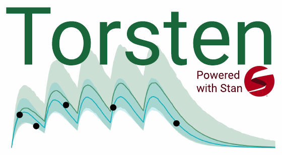

My research on methods and algorithms is complemented by the development of open-source software, which empower scientists to make the most out of their data.

# Stan: a probablistic programming language

[Stan](https://mc-stan.org/) is a probabilistic programming language that lets users define a probabilistic model, translates it to C++, then performs Bayesian inference using gradient-based algorithms. Stan is used across the physical, biological, and social sciences, as well as in finance, government, medicine, policy, and leisure.

I have been a core developer of Stan since 2016.
I have primarily contributed to Stan's C++ automatic differentiation library and its support for implicit functions including:
* integrated Laplace approximation (upcoming!) [[technical report](https://arxiv.org/abs/2306.14976), [notebook](https://htmlpreview.github.io/?https://github.com/charlesm93/StanCon2020/blob/master/notebook-2022/lgm_stan.html)]
* suite of hidden Markov model functions
* algebraic equation solver
* matrix exponential function for solving linear ODEs

I am also an active member of the Stan community.
I am currently a member of the Stan Governing Body for a two-year term, where I have spearheaded efforts to bring back StanCon after a hiatus during the pandemic.
I served on the organization committee of the last two conferences:
* [StanCon 2024](https://mc-stan.org/events/stancon2024/) at Oxford University, UK
* [StanCon 2023](https://mc-stan.org/events/stancon2023/) at Washington University in St. Louis, MO
Occasionally, I answer queries on the [Stan forum](https://discourse.mc-stan.org/), where I am in the excellent company of other Stan veterans who answer many more questions than I do.  
I also teach a lot of workshops on Stan (see the [teaching](https://charlesm93.github.io/teaching/) section.)

# Torsten: an extension of Stan for pharmacometrics

In 2015, I co-created [Torsten](https://metrumresearchgroup.github.io/Torsten/) to facilitate application of Stan to pharmacometrics modeling.
The package contains several new functions, inlcuding:
* analytical solution for one-and-two compartment pharmacokinetic models, and semi-analytical solvers for pharmacokinetic/pharmacodynamic models
* functions to handle the event schedule of clinical trials. 

Torsten is open-source and it is supported by [Metrum Research Group](https://www.metrumrg.com/).

# Other software

I have contributed to the following R packages:
* mrgsolve: pharmacometrics and quantitative systems pharmacology simulation in R. [[Home page](https://mrgsolve.github.io/)]
* bayesplot: plotting Bayesian models [[Home page](https://mc-stan.org/bayesplot/)]  
